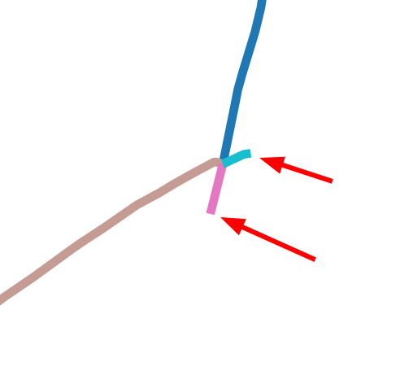
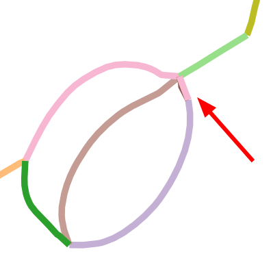

# Reconstruction of Machine-Made Shapes from Bitmap Sketches

> Project page: https://puhachov.xyz/publications/machine-made-sketch-reconstruction/

acm: https://dl.acm.org/doi/10.1145/3618361

### Image Credits
We tested our code on images from multiple sources.

|   Name   |   Filename                                            |   Source                     |
|----------------------|-------------------------------------------------------|------------------------------|
|   armachair          |   armchair1_0_clean.png + line_armchair1_0_clean.png  |   Delanoy et al. 2019        |
|   bin                |   bin115.png                                          |   ©️Eissen and Steur 2011     |
|   building           |   s9_house_view1.png                                  |   Gryaditskaya et al. 2019   |
|   camera             |   3dsketching_camera2.png                             |   Delanoy et al. 2019        |
|   car                |   3dsketching_car.png                                 |   Delanoy et al. 2019        |
|   chair30            |   chair30.png                                         |   ©️Eissen and Steur 2011     |
|   chair37            |   chair37.png                                         |   ©️Eissen and Steur 2011     |
|   cylinder           |   Cylindrical_Parts_011_1.png                         |   Manda et al. 2021          |
|   goblet             |   goblet_0_clean.png                                  |   Delanoy et al. 2019        |
|   hexnut             |   Nuts_013_1.png                                      |   Manda et al. 2021          |
|   house              |   house_4views_1_clean.png                            |   Delanoy et al. 2019        |
|   machine            |   grinder124line.png                                  |   ©️Eissen and Steur 2011     |
|   nut                |   tun2.png                                            |   ours                       |
|   pulley             |   Pulley_Like_Parts_007_1.png                         |   Manda et al. 2021          |
|   train              |   3dsketching_train2.png                              |   Delanoy et al. 2019        |
|   wagon              |   wagon_hole_06_0_clean.png                           |   Delanoy et al. 2019        |
|   vacuum (Fig 23)    |   p5_vacuum_cleaner_view1.png                         |   Gryaditskaya et al. 2019   |

* Delanoy et al. 2019 “3D Sketching using Multi-View Deep Volumetric Prediction” https://perso.liris.cnrs.fr/johanna.delanoy/2018_3D_sketching/index.html
* Eissen and Steur 2011 “Sketching: The Basics” https://www.kooseissen.nl/startFpapers.html
* Gryaditskaya et al. 2019 “OpenSketch: A Richly-Annotated Dataset of Product Design Sketches” https://ns.inria.fr/d3/OpenSketch/
* Manda et al. 2021 “‘CADSketchNet’ - An Annotated Sketch dataset for 3D CAD Model Retrieval with Deep Neural Networks” https://bharadwaj-manda.github.io/CADSketchNet/

### Acknowledgements
We would like to thank the following open-source libraries that were used for prototyping and development:
* Pyomo http://www.pyomo.org/
* Ipopt https://coin-or.github.io/Ipopt/
* libigl https://libigl.github.io/
* Triangle https://www.cs.cmu.edu/~quake/triangle.html
* LineFiller for trapped ball algorithm implementation https://github.com/hepesu/LineFiller
* geomfitty https://github.com/mark-boer/geomfitty
* scikit-guess https://github.com/madphysicist/scikit-guess
* svgpathtools https://github.com/mathandy/svgpathtools

#### TODO
* [ ] debug error `'AMPLRepn' object is not subscriptable`
* [ ] explain modification for vectorization code
* [ ] fix other [Known Issues](#known-issues).

## Evaluate
 * `bash run_preprocess.sh examples/tun2.png` will run our image pre-processing on `examples/tun2.png` (adjust, rescale image, evaluate models, vectorize) and place temporary files in `results/tun2/`. You may skip some stages or perform them separately (see the bash script)
 * `python main.py --pngname tun2` will run our optimization routine using files in `results/tun2/`. The final result is placed in `output/`
 * for bulk execution use `bash run_folder.sh`

## Setup
```
conda create -n mmsketch python=3.10
conda install conda-forge::igl
conda install conda-forge::matplotlib
conda install -c conda-forge triangle
conda install -c conda-forge opencv
conda install -c conda-forge svgpathtools
conda install anaconda::scikit-learn
conda install -c conda-forge pyomo
conda install -c conda-forge ipopt
conda install anaconda::scikit-image
conda install -c conda-forge cvxpy
conda install conda-forge::matplotlib
conda install -c conda-forge openexr-python
pip install triangle
pip install scikit-guess
pip install pillow==9.5.0
```

#### Pre-processing
We use imagemagick and morphology (http://www.fmwconcepts.com/imagemagick/morphology/index.php)
```bash
sudo apt-get install imagemagick
```

#### ML libs
To evaluate ML predictions we recommend using GPU. Evaluation on CPU is also possible (slower).

Models were developed with PyTorch (), PyTorch Lightning (https://github.com/Lightning-AI/pytorch-lightning), and segmentation_models.pytorch (https://github.com/qubvel/segmentation_models.pytorch)

```bash
conda install pytorch==1.13.1 torchvision==0.14.1 torchaudio==0.13.1 pytorch-cuda=11.7 -c pytorch -c nvidia
pip install segmentation-models-pytorch
conda install lightning -c conda-forge
pip install torchmetrics==0.11.4
```

#### Vectorization
We use modified vectorization code from "Keypoint-Driven Line Drawing Vectorization via PolyVector Flow" https://github.com/ivanpuhachov/line-drawing-vectorization-polyvector-flow
> Y-junction solve was disabled to prevent overlapping lines in the final vectorization

We provide compiled binaries for Ubuntu 20.04. Instructions on how to build it on your own will be released soon. 

#### Triangle
Triangle is used for flat 2d triangulation – https://www.cs.cmu.edu/~quake/triangle.html
* to build for your machine rung `make` in Triangle folder

## Known issues

* [ ] svg cleaning may fail if overlapping lines. It was never tested on complex svg files, and relies on a very slow intersection test from svgpathtools. Temporary fix is to perform the cleaning manually, as svg cleaning was out of the scope of this project.

* [ ] triangulation fails on non-watertight vectorizations

* [ ] you can override segment classification with a `MANUAL_labels.json` file

* [ ] error `'AMPLRepn' object is not subscriptable` happens on `grinder` and `camera`, investigating (fix ipopt version?)



Code fails if a vectorization line lies on a background (the only neighboring patch has label "Background"). The easiest way to fix it is to manially remove those with Inkscape.



Ocasionally vectorization may output overlapping lines. This may or may not result in failed runs. Solution: remove this manually.